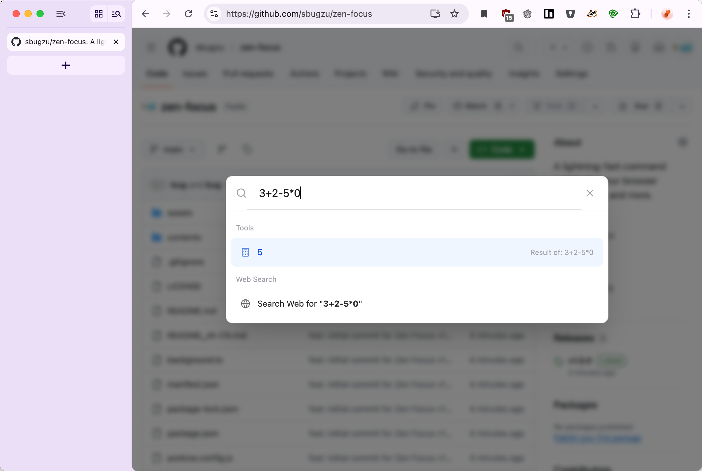

# ⚡ Zen Focus

> 极速响应、纯键盘驱动的浏览器 Command Palette (命令面板) 扩展。

[English](README.md) | **简体中文**

Zen Focus 是一款为效率控量身定制的 Chrome 浏览器插件。它将类似于 Raycast 或 Alfred 的使用体验带入了你的网页中。按下快捷键即可唤醒浮动命令面板，瞬间检索、切换标签页，翻看历史记录、书签，或使用内置的黑科技效率插件！



## ✨ 核心特性

- **极致速度**：基于 Shadow DOM 直接注入当前页面，告别传统 Extension Popup 弹窗的卡顿感和加载延迟问题。
- **纯键盘驱动**：全程无需触碰鼠标。支持方向键和回车键操作一切。
- **全域搜索能力**：
  - 检索已打开的标签页 (`Tabs`)
  - 书签收藏 (`Bookmarks`)
  - 浏览历史 (`History`)
  - 全文直接兜底跳转至系统的默认搜索引擎 (`Default Search Engine`)
- **⚙️ 超强原生插件系统**：
  - **极速数学求值**：输入 `128 * 4 + 7` ，基于原生手写的 AST 解析器，瞬间给出计算结果，不卡顿、无外部依赖。
  - **自然汇率转换**：支持 `100 usd in cny` 或 `50 eur to jpy` 等自然语言式快捷换算，实时拉取并带有一小时本地缓存。
  - **色彩十六进制互转**：输入 `#FF5733` 或者 `rgb(255, 255, 255)`，自动转化为对应的 RGB / HSL 并提供点击一键复制。
- **隐私且安全**：核心功能纯本地运作，计算与解析零依赖外部环境（除汇率需拉取开放接口获取基准值外）。插件绝不会追踪您的输入或跨站发送使用习惯，充分尊重您的隐私与数据安全。

## 🚀 立即体验

1. `git clone` 或直接下载本项目。
2. 在项目根目录执行环境依赖安装：
   ```bash
   npm install
   ```
3. 编译出供浏览器加载使用的最终产物：
   ```bash
   npm run build
   ```
4. 打开 Chrome 的扩展设置页：`chrome://extensions/`
5. 开启右上角的 **"开发者模式"**。
6. 点击左上方 **"加载已解压的扩展程序"**。
7. 选中项目文件夹中新生成的 `build/chrome-mv3-prod` 目录即可！

## ⌨️ 默认快捷键
- **macOS / Windows**: `Alt + Space` （或者取决于您在 Chrome 设置页面 `chrome://extensions/shortcuts` 里的配置）

## 📄 开源说明
基于 **MIT 协议** 开放源代码。非常欢迎提交 PR 或针对插件框架扩展属于您的本地化实用功能！
